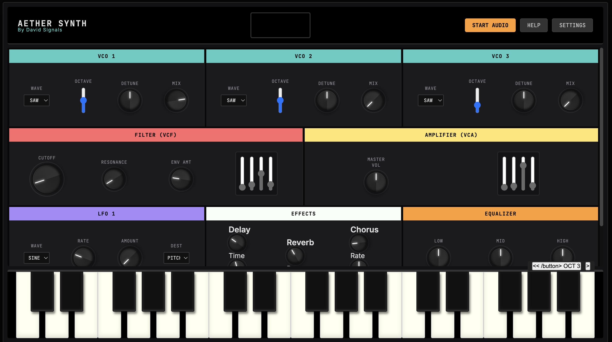
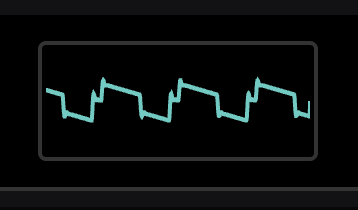

# 🎹 Aether Synth

### *A Hybrid Web Synthesizer - Where Moog Meets Prophet*

### AetherSynth Interface

## 📖 Overview

**Aether Synth** is a powerful web-based synthesizer that bridges the gap between the legendary warmth of **Moog** and the versatile polyphony of **Prophet**. Built with the Web Audio API, this hybrid instrument brings analog-inspired sound synthesis directly to your browser with a stunning glass-morphism interface.

> *"Where the warmth of analog meets the precision of digital"*

## ✨ Features

### 🎛️ **Three Oscillator Architecture**
- Individual VCO controls with octave selection (32', 16', 8', 4', 2')
- Multiple waveform options: Sawtooth, Square, Triangle, Sine
- Dedicated **detune control** for VCO 3
- Independent level mixing per oscillator
- **FM/Cross-modulation** capabilities

### 🔮 **Legendary Filter Section**
- Moog-style **24dB/octave** low-pass filter
- Prophet-inspired **12dB/octave** option
- Cutoff, Resonance, and Envelope Amount controls
- **Self-oscillating** resonance capability

### 🎚️ **Comprehensive Modulation**
- **Two LFOs** with multiple waveforms:
  - Sine, Triangle, Sawtooth, Square, Sample & Hold
- Multiple modulation destinations:
  - Pitch (Vibrato)
  - Filter (Wah)
  - Amplitude (Tremolo)
  - PWM
- Independent **Rate** and **Amount** controls

### 🎸 **Professional Effects Suite**
- **Analog-style Delay** with Time control
- **Rich Chorus** effect
- **Spring Reverb** emulation
- **Three-band EQ** (Low, Mid, High)

### 🎹 **Performance Features**
- Polyphonic (up to 8 voices), Unison, and Mono modes
- **3-octave virtual keyboard**
- Master Volume control
- Filter ADSR and Amplifier ADSR envelopes

### ⚙️ **Advanced Configuration**
- **Audio device selection** (choose your sound card/interface)
- Adjustable polyphony (1-8 voices)
- Master tuning (432Hz / 440Hz)
- Modern **glass-morphism UI** with vintage aesthetic

### **Real-time Response**

The oscilloscope display updates instantly as you:

### OSC Display

- 🎛️ **Adjust oscillators** - Watch waveforms transform in real-time
- 🔧 **Sweep the filter** - See harmonics being carved
- 🌊 **Apply LFO** - Visualize cyclic modulation
- 🎚️ **Tweak envelopes** - Observe attack, decay, sustain, and release
- ⚡ **Play notes** - Watch the sound breathe with velocity

## 🎯 **Design Philosophy**

Aether Synth combines the best of both worlds:

| **Moog DNA** | **Prophet DNA** |
|--------------|-----------------|
| Thick, aggressive bass | Warm analog polyphony |
| Iconic ladder filter response | Flexible modulation matrix |
| 24dB/octave filter character | 12dB/octave option |

The interface features a **dark glass-morphism** design with:
- 🟠 Orange accents (Moog inspiration)
- 🔵 Cyan highlights (Prophet inspiration)

Creating an intuitive yet professional environment for sound design.

## 🚀 **Getting Started**

### **Quick Start Guide**

1. **Initialize Audio**
   - Click **`START AUDIO`** to initialize the audio context

2. **Configure Output**
   - Go to **`SETTINGS`** and select your audio output device

3. **Create Your First Sound**
   - Choose a waveform on any VCO
   - Adjust its level
   - Play the virtual keyboard

4. **Shape Your Tone**
   - Experiment with the filter cutoff and resonance
   - Modulate with LFOs
   - Add effects (Delay, Chorus, Reverb)

### **First-Time User?**
The built-in interactive tutorial will guide you through the basics when you first launch the app.

## 🛠️ **Built With**

- **Web Audio API** - Low-latency audio processing
- **Vanilla JavaScript** - Pure, framework-free implementation
- **HTML5/CSS3** - Modern semantic structure and styling
- **Glass-morphism** - Contemporary UI design principles

## 🎵 **Perfect For**

- 🎧 **Sound designers** exploring hybrid analog textures
- 🎹 **Producers** seeking quick inspiration
- 👨‍🏫 **Educators** teaching synthesis fundamentals
- 🎪 **Live performers** needing a versatile software synth

## 📋 **Requirements**

- Modern web browser (Chrome, Firefox, Safari, Edge)
- Web Audio API support
- Audio output device (built-in speakers, headphones, or audio interface)
